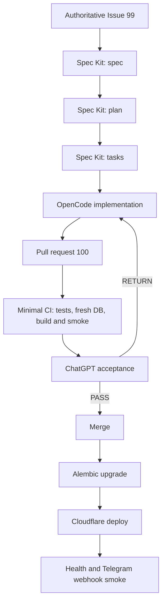
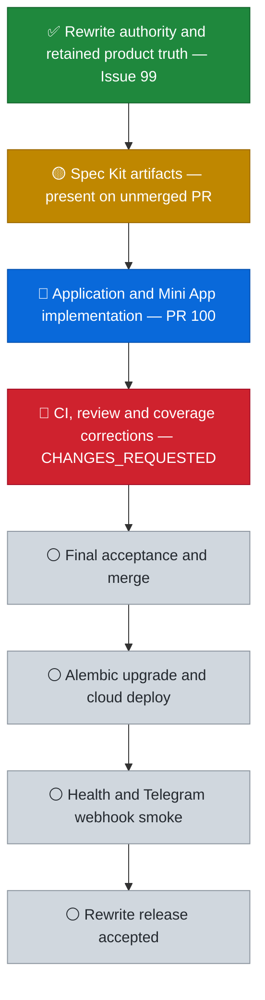

# PASAY Rewrite Project Status

> Last verified: 2026-08-31 UTC.  
> Live work is tracked by GitHub Issues, pull requests, checks and GitHub Projects. This visual snapshot follows the rewrite authority in Issue #99 and excludes retired Milestone gates, 17-door freeze, qualification probes, duplicate dispatchers and complex reviewer governance.

## Current snapshot

| Item | Verified status |
| --- | --- |
| Authoritative branch | `feature/telegram-ui-v2` |
| Rewrite authority | [Issue #99 — clean rewrite + Mini App + simple cloud delivery](https://github.com/jhackuy/pasay-pm/issues/99), open |
| Active delivery | [PR #100 — complete application + Mini App + simple cloud delivery](https://github.com/jhackuy/pasay-pm/pull/100), open, 51 commits / 151 changed files |
| Current head | `751531f2c1830101cd61bedae3277d794e7ae1cb` |
| CI | `rewrite-ci` **in progress** at verification time |
| Review | **CHANGES_REQUESTED** remains; merge is blocked until findings are cleared and re-verified |
| Spec Kit artifacts | `spec.md`, `plan.md`, `tasks.md` and coverage matrix exist on PR #100 head, not yet merged |
| Progress counting | `tasks.md` checkboxes are stale and therefore are **not** used to claim a percentage |
| Merge state | **Forbidden until current CI, review, product coverage and ChatGPT acceptance pass** |

## Development workflow

## Project progress

## Status meaning

- **Done** requires accepted evidence; file presence, commit volume or a green sub-check alone is not completion.
- **Active** means OpenCode is advancing the authoritative rewrite.
- **Blocked** means the PR cannot merge, not that development must stop.
- **Pending** means no accepted evidence exists for that stage.
- Update this snapshot only when Issue, PR, CI, review, acceptance or deployment state materially changes.
