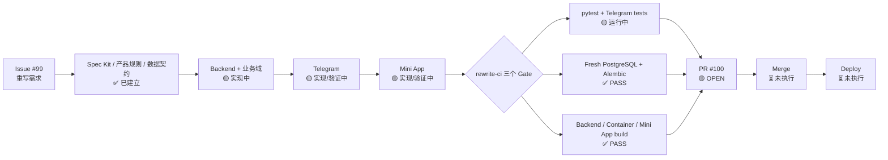

# PASAY 重写项目状态

> 单一事实源：Issue #99、PR #100、GitHub Actions。此页用于 GitHub 原生 Mermaid 可视化；Slack 只展示摘要和 Thread 更新，不作为代码状态事实源。

## 当前线性进度

## 状态解释

- ✅ **已验证**：有 GitHub Actions 或仓库事实证据支持。
- 🟡 **执行中**：代码或验证仍在推进，不能按“文件存在”直接判定完成。
- ⏳ **未执行**：尚未进入该阶段。
- ❌ **失败/阻塞**：只有当前 GitHub 事实明确失败或阻塞时才标记。

## 当前事实

- 主任务：Issue #99 — PASAY clean rewrite。
- 主 PR：PR #100 — `opencode/issue99-20260829042355` → `feature/telegram-ui-v2`。
- 当前 CI：`fresh-postgres-alembic` 已通过；`build-core-smoke` 已通过；`pytest` 当前仍在执行。
- Mini App build 通过只代表构建 Gate 通过，不代表整个 Mini App 产品功能已完成。
- `tasks.md` 的 checkbox 不再单独作为真实进度依据；任务完成必须以对应 acceptance + GitHub 证据为准。

## 证据入口

- Issue #99: https://github.com/jhackuy/pasay-pm/issues/99
- PR #100: https://github.com/jhackuy/pasay-pm/pull/100
- Actions: https://github.com/jhackuy/pasay-pm/actions

## 更新规则

1. 只依据 Issue / PR / Actions / 已验证文件状态更新。
2. 不允许 Agent 仅凭“已创建文件”把任务标记完成。
3. CI 状态优先使用当前 PR HEAD 对应的最新 `rewrite-ci`。
4. GitHub Mermaid 是可视化状态页；Slack 使用同一事实源生成中文管理摘要和 Thread 变更记录。
